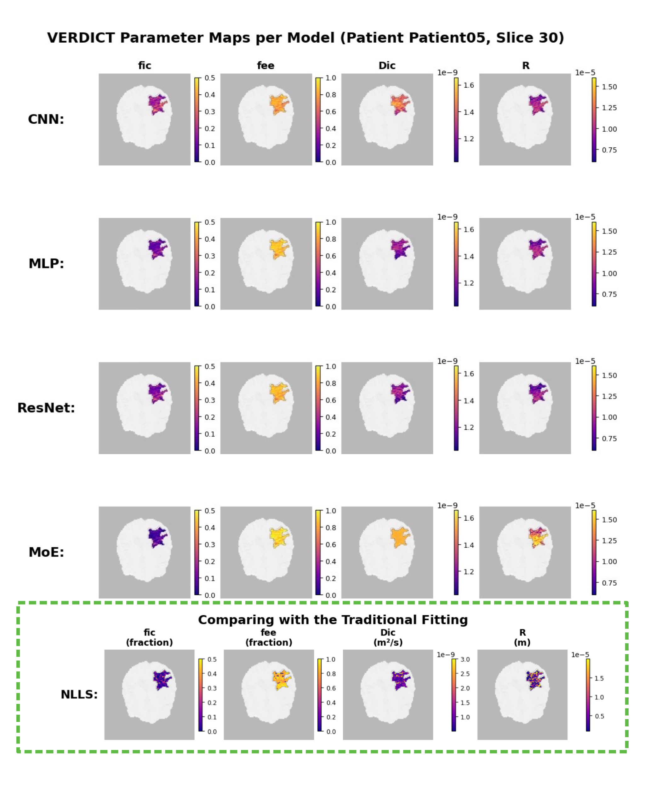

# VERDICT Benchmark: Deep Learning for Medical Parameter Prediction



## 🔬 What is VERDICT?

VERDICT is an advanced diffusion MRI technique that provides quantitative biomarkers for tissue microstructure analysis. It models tissue as three distinct compartments:
- **Vascular**: Blood vessels and vasculature
- **Extracellular**: Extracellular space
- **Restricted**: Intracellular space (cells)

This benchmark evaluates how well different neural network architectures can predict these critical medical parameters from imaging features.

## 🎯 Project Overview

This benchmark provides:
- **State-of-the-art Models**: From simple MLPs to advanced architectures
- **Comprehensive Evaluation**: Statistical analysis with confidence intervals
- **Standardized Training**: Consistent protocols across all models
- **Publication-ready Results**: LaTeX tables and research-grade figures
- **Extensible Framework**: Easy to add new models and datasets

## � Key Findings

Based on comprehensive evaluation across 8 state-of-the-art architectures:

- **🥇 Best Overall**: Residual MLP achieves highest R² (0.532) with excellent parameter efficiency
- **🎯 Lowest Error**: MoE achieves best RMSE (0.303) despite requiring more parameters  
- **💡 Efficiency Champion**: Standard MLP provides strong baseline (R² = 0.527) with minimal complexity
- **📈 Skip Connections Matter**: Residual connections consistently improve performance over standard feedforward
- **🔍 Architecture Insights**: Complex models don't always guarantee better performance on tabular medical data

*Complete evaluation results available in `advanced_evaluation/` with statistical significance testing*

## �🏗️ Architecture Zoo

Our benchmark includes diverse neural network architectures, each with detailed documentation:

### 📊 Feedforward Networks
- **[Multi-Layer Perceptron (MLP)](docs/models/README_MLP.md)** - Simple yet effective baseline
  - 3-layer architecture with configurable activations
  - Fast training and inference
  - Excellent starting point for tabular data

- **[Simple ResNet (Residual MLP)](docs/models/README_ResidualMLP.md)** - Enhanced with skip connections
  - Solves vanishing gradient problem
  - Enables deeper network training
  - Better performance on complex patterns

### 🌊 Sequence Models
- **[Recurrent Neural Network (RNN)](docs/models/README_RNN.md)** - Temporal pattern modeling
  - LSTM/GRU variants for sequence processing
  - Adaptive input reshaping strategies
  - Captures sequential dependencies

- **[Transformer](docs/models/README_Transformer.md)** - Attention-based architecture
  - Multi-head self-attention mechanisms
  - Parallel processing capabilities
  - Global feature relationship modeling

### 🔍 Convolutional Networks
- **[Convolutional Neural Network (CNN)](docs/models/CNN_IMPROVEMENTS.md)** - Spatial pattern recognition
  - 1D convolutions for feature extraction
  - Hierarchical representation learning
  - Translation-invariant features

### 🧠 Advanced Architectures
- **[Variational Autoencoder (VAE)](docs/models/README_VAE.md)** - Probabilistic latent modeling
  - Learns compressed representations
  - Uncertainty quantification
  - Generative capabilities

- **[Mixture of Experts (MoE)](docs/models/MOE_ARCHITECTURE.md)** - Ensemble learning
  - Specialized expert networks
  - Dynamic routing mechanisms
  - Scalable model capacity

### 🎯 Attention-Based Tabular Networks
- **[TabNet](docs/models/README_TabNet.md)** - State-of-the-art tabular learning
  - Sequential attention mechanisms
  - Built-in interpretability features
  - Optimized for structured data
  - Feature importance analysis

## 🚀 Quick Start

### Prerequisites
```bash
# Python 3.8+ required
pip install torch torchvision torchaudio
pip install -r requirements_eval.txt

# Optional: Install in development mode
pip install -e .
```

### Installation Verification
```bash
# Check if installation is working
python -c "from models.mlp import MLP; print('✅ Models imported successfully')"
python -c "from data.dataset import VERDICTDataset; print('✅ Dataset imported successfully')"
python -c "from utils.metrics import calculate_metrics; print('✅ Utils imported successfully')"
```

### 1. Training Models
```bash
# Train individual models
python train.py --config configs/mlp.yaml
python train.py --config configs/transformer.yaml
python train.py --config configs/cnn_advanced.yaml
python train.py --config configs/tabnet_regressor.yaml

# Train all models (Windows)
run_evaluation.bat
```

### 2. Evaluation
```bash
# Basic evaluation
python evaluate_models.py --config configs/mlp.yaml

# Advanced statistical analysis
python advanced_evaluate.py --config configs/mlp.yaml

# Train and evaluate TabNet model
python train.py --config configs/tabnet_regressor.yaml

# Automated evaluation (recommended)
run_evaluation.bat
```

### 3. Results
Results are automatically saved to:
- `advanced_evaluation/` - Statistical analysis and publication-ready figures
- `wandb/` - Weights & Biases experiment tracking
- `checkpoints/` - Trained model weights and scalers

##  Model Implementation Status

| Model | Implementation | Config | Documentation | Status |
|-------|---------------|---------|---------------|---------|
| MLP | ✅ `mlp.py` | ✅ `mlp.yaml` | ✅ `README_MLP.md` | Ready |
| Residual MLP | ✅ `residual_mlp.py` | ✅ `residual_mlp.yaml` | ✅ `README_ResidualMLP.md` | Ready |
| RNN/LSTM | ✅ `rnn.py` | ✅ `rnn.yaml` | ✅ `README_RNN.md` | Ready |
| Transformer | ✅ `transformer.py` | ✅ `transformer.yaml` | ✅ `README_Transformer.md` | Ready |
| CNN | ✅ `cnn.py` | ✅ `cnn_advanced.yaml` | ✅ `CNN_IMPROVEMENTS.md` | Ready |
| VAE | ✅ `vae_regressor.py` | ✅ `vae_regressor.yaml` | ✅ `README_VAE.md` | Ready |
| MoE | ✅ `moe_regressor.py` | ✅ `moe_regressor.yaml` | ✅ `MOE_ARCHITECTURE.md` | Ready |
| TabNet | ✅ `tabnet_regressor.py` | ✅ `tabnet_regressor.yaml` | ✅ `README_TabNet.md` | Ready |

**All models are fully implemented and ready for training and evaluation!**

## 📈 Performance Overview

*Based on comprehensive evaluation results from July 2025*

| Rank | Model | R² Score | RMSE | MAE | Parameters | Architecture Type |
|------|-------|----------|------|-----|------------|-------------------|
| 🥇 | **Residual MLP** | **0.532** | 0.304 | 0.144 | ~60K | Feedforward + Skip Connections |
| 🥈 | **CNN Advanced** | 0.530 | 0.305 | 0.148 | ~120K | Convolutional + Attention |
| 🥉 | **Transformer** | 0.524 | 0.305 | 0.145 | ~100K | Self-Attention |
| 4 | **MLP** | 0.527 | 0.305 | 0.146 | ~50K | Feedforward Baseline |
| 5 | **MoE** | 0.440 | **0.303** | 0.144 | ~200K | Ensemble Learning |
| 6 | **TabNet** | 0.494 | 0.318 | 0.160 | ~150K | Attention-based Tabular |
| 7 | **VAE** | 0.463 | 0.309 | 0.152 | ~150K | Probabilistic Latent |
| 8 | **RNN (LSTM)** | 0.480 | 0.324 | 0.162 | ~80K | Sequential Processing |

**Key Insights:**
- **Best Overall Performance**: Residual MLP achieves highest R² (0.532) with excellent efficiency
- **Lowest RMSE**: MoE achieves best error minimization (0.303) despite lower R²
- **Best Efficiency**: MLP provides strong baseline performance with minimal parameters
- **Most Complex**: MoE and VAE require more parameters but show mixed results

### 📊 Performance Visualizations

Our comprehensive evaluation includes detailed analysis and publication-ready visualizations:

| Analysis Type | Visualization | Description |
|---------------|---------------|-------------|
| **Overall Comparison** | `performance_comparison.png` | Model rankings across all metrics |
| **Statistical Analysis** | `confidence_intervals.png` | Bootstrap confidence intervals |
| **Parameter Analysis** | `parameter_wise_primary_metrics.png` | Per-parameter performance breakdown |
| **Error Analysis** | `error_distributions.png` | Error distribution patterns |
| **Significance Testing** | `significance_tests.png` | Statistical significance between models |
| **Complexity Analysis** | `complexity_analysis.png` | Performance vs. model complexity |

## 📊 Comprehensive Evaluation

### Basic Metrics
- **R² Score**: Coefficient of determination
- **RMSE**: Root Mean Square Error
- **MAE**: Mean Absolute Error
- **Per-parameter Analysis**: Individual parameter performance

### Advanced Statistics
- **Statistical Significance**: Pairwise model comparisons
- **Bootstrap Confidence Intervals**: Uncertainty quantification
- **Effect Sizes**: Practical significance assessment

### Evaluation Documentation
- **[Evaluation Guide](docs/eval/EVALUATION_README.md)** - Complete evaluation instructions

## 🛠️ Project Structure

```
verdict_benchmark/
├── 📁 assets/                   # Project visualizations
│   ├── multi_patients.png       # Multi-patient analysis overview
│   ├── multi_models_top.png     # Top model comparisons
│   └── multi_models_bottom.png  # Model performance details
├── 📁 models/                   # Model implementations
│   ├── mlp.py                   # Multi-Layer Perceptron
│   ├── residual_mlp.py          # Residual MLP
│   ├── rnn.py                   # RNN/LSTM/GRU
│   ├── transformer.py           # Transformer
│   ├── cnn.py                   # Convolutional Network
│   ├── vae_regressor.py         # Variational Autoencoder
│   ├── moe_regressor.py         # Mixture of Experts
│   └── tabnet_regressor.py      # TabNet (Attentive Tabular Learning)
├── 📁 configs/                  # Configuration files
│   ├── mlp.yaml                 # MLP settings
│   ├── transformer.yaml         # Transformer settings
│   ├── cnn_advanced.yaml        # CNN settings
│   ├── rnn.yaml                 # RNN settings
│   ├── residual_mlp.yaml        # Residual MLP settings
│   ├── vae_regressor.yaml       # VAE settings
│   ├── moe_regressor.yaml       # MoE settings
│   └── tabnet_regressor.yaml    # TabNet settings
├── 📁 advanced_evaluation/      # Evaluation results
│   ├── performance_comparison.png # Model performance visualizations
│   ├── model_rankings.csv       # Quantitative rankings
│   ├── confidence_intervals.png # Statistical confidence intervals
│   ├── significance_tests.png   # Statistical significance analysis
│   ├── parameter_wise_*.png     # Parameter-specific analysis
│   └── evaluation_summary.txt   # Comprehensive evaluation summary
├── 📁 docs/                     # Documentation
│   ├── models/                  # Model documentation
│   │   ├── README_MLP.md        # MLP guide
│   │   ├── README_ResidualMLP.md # Residual MLP guide
│   │   ├── README_RNN.md        # RNN guide
│   │   ├── README_Transformer.md # Transformer guide
│   │   ├── README_VAE.md        # VAE guide
│   │   ├── README_TabNet.md     # TabNet guide
│   │   ├── CNN_IMPROVEMENTS.md  # CNN enhancements
│   │   └── MOE_ARCHITECTURE.md  # MoE architecture
│   └── eval/                    # Evaluation documentation
│       └── EVALUATION_README.md # Evaluation guide
├── 📁 data/                     # Dataset utilities
│   ├── dataset.py               # Data loading
│   └── demodataset.ipynb        # Data exploration
├── 📁 utils/                    # Utility functions
│   ├── metrics.py               # Evaluation metrics
│   └── scaler.py                # Data preprocessing
├── 📁 checkpoints/              # Trained models
├── 📁 logs/                     # Training logs
├── 📄 train.py                  # Training script
├── 📄 evaluate_models.py        # Basic evaluation
├── 📄 advanced_evaluate.py      # Advanced analysis
├── 📄 run_evaluation.bat        # Automated evaluation
└── 📄 setup.py                  # Package setup
```

## 🎓 Research Applications

### Medical Imaging
- **Cancer Research**: Tumor microenvironment analysis
- **Treatment Monitoring**: Therapy response assessment
- **Diagnostic Support**: Quantitative biomarker extraction

### Machine Learning
- **Architecture Comparison**: Systematic model evaluation
- **Tabular Learning**: Benchmark for structured data
- **Medical AI**: Healthcare-specific deep learning

### Publications
This benchmark has been designed to support:
- **Reproducible Research**: Standardized evaluation protocols
- **Fair Comparison**: Consistent training and evaluation
- **Statistical Rigor**: Proper significance testing
- **Publication Quality**: LaTeX tables and figures

## 🔬 Dataset Information

### VERDICT Training Data
- **Features**: 153-dimensional imaging features
- **Targets**: 8 VERDICT parameters
- **Samples**: Professional medical imaging dataset
- **Preprocessing**: Standardized scaling and normalization

### Data Loading
```python
from data.dataset import VERDICTDataset
dataset = VERDICTDataset(mat_path="path/to/TrainingSet.mat")
```

## 📚 Model Documentation

Each model includes comprehensive documentation:

### Architecture Guides
- **[MLP README](docs/models/README_MLP.md)** - Simple feedforward networks
- **[Residual MLP README](docs/models/README_ResidualMLP.md)** - Skip connections and deep networks
- **[RNN README](docs/models/README_RNN.md)** - Sequence modeling with LSTM/GRU
- **[Transformer README](docs/models/README_Transformer.md)** - Attention mechanisms
- **[DenseNet README](docs/models/README_DenseNet.md)** - Dense connections and feature reuse
- **[VAE README](docs/models/README_VAE.md)** - Variational autoencoders
- **[TabNet README](docs/models/README_TabNet.md)** - Attentive interpretable tabular learning
- **[MOE README](docs/models/MOE_ARCHITECTURE.md)** - Ensemble learning with specialized expert networks

## 🎯 Customization

### Adding New Models
1. Create model class in `models/`
2. Add configuration in `configs/`
3. Update training script imports
4. Create model-specific README

### Custom Datasets
1. Implement dataset class in `data/`
2. Update configuration files
3. Adjust input/output dimensions
4. Modify evaluation metrics if needed

### Hyperparameter Tuning
Each model includes extensive hyperparameter documentation:
- Architecture scaling guidelines
- Training parameter suggestions
- Regularization techniques
- Performance optimization tips

## 🔍 Advanced Features

### Weights & Biases Integration
```yaml
wandb_project: verdict_benchmark
wandb_run_name: model_experiment
```

### Learning Rate Scheduling
```yaml
scheduler:
  type: CosineAnnealingWarmRestarts
  T_0: 15
  T_mult: 2
  eta_min: 0.000001
```

### Early Stopping
```yaml
early_stop_patience: 40
```

## 🤝 Contributing

We welcome contributions! Please see our contribution guidelines:

1. **Fork** the repository
2. **Create** a feature branch
3. **Add** your model or improvement
4. **Test** thoroughly
5. **Submit** a pull request

### Areas for Contribution
- New model architectures
- Evaluation metrics
- Visualization improvements
- Documentation enhancements
- Performance optimizations

## 📄 Citation

If you use this benchmark in your research, please cite:

```bibtex
@article{202602.0470,
	doi = {10.20944/preprints202602.0470.v1},
	url = {https://doi.org/10.20944/preprints202602.0470.v1},
	year = 2026,
	month = {February},
	publisher = {Preprints},
	author = {Zheng Yu},
	title = {Benchmark: Deep Learning Methods for VERDICT MRI in Brain Tumour Microstructure Characterisation},
	journal = {Preprints}
}
```

## 🔗 Related Work

- **VERDICT MRI**: Original diffusion MRI technique for tissue microstructure analysis
- **Medical AI Benchmarks**: Related benchmarks in medical imaging and deep learning
- **Tabular Learning**: Advances in neural networks for structured data
- **PyTorch Ecosystem**: Deep learning frameworks and tools

## 📞 Support

### Troubleshooting

**Common Issues:**
- **ImportError**: Make sure all dependencies are installed with `pip install -r requirements_eval.txt`
- **CUDA Issues**: Ensure PyTorch is installed with CUDA support if using GPU
- **Memory Errors**: Reduce batch size in config files for large models
- **Config Errors**: Check YAML syntax and ensure all required fields are present

**Performance Tips:**
- Use GPU for faster training (CUDA compatible)
- Adjust batch size based on available memory
- Enable mixed precision training for memory efficiency
- Use early stopping to prevent overfitting

### Documentation
- **[Evaluation Guide](docs/eval/EVALUATION_README.md)** - Complete evaluation instructions
- **[Model READMEs](docs/models/)** - Individual architecture documentation
- **[CNN Improvements](docs/models/CNN_IMPROVEMENTS.md)** - CNN-specific enhancements
- **[MoE Architecture](docs/models/MOE_ARCHITECTURE.md)** - Mixture of Experts details

### Issues
- Check existing issues on GitHub
- Create detailed bug reports
- Include configuration files and logs
- Provide minimal reproducible examples

## 📜 License

This project is licensed under the MIT License - see the [LICENSE](LICENSE) file for details.

## 🙏 Acknowledgments

- VERDICT methodology developers
- Medical imaging research community
- PyTorch and scientific computing ecosystem
- Open source contributors

